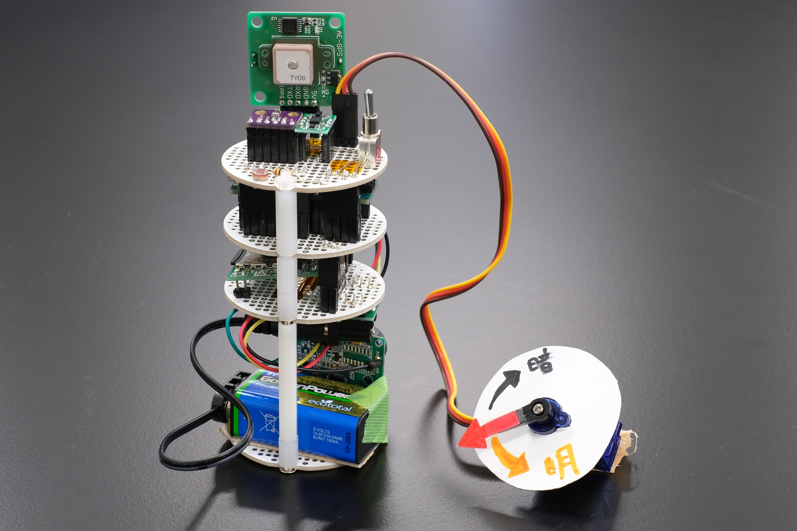

# 実装例 - 明るさ計
## 概要
+ 明るさに応じてサーボが回転し，明るさを差す．
+ [プログラミング講習 09. アプリケーション例](../ProgrammingTutorial10_Application)も参照のこと．

## ソースコードへのリンク
[GitHub](https://github.com/meltingrabbit/CanSatForHighSchoolStudents/tree/master/Arduino/App_LightMeter)
