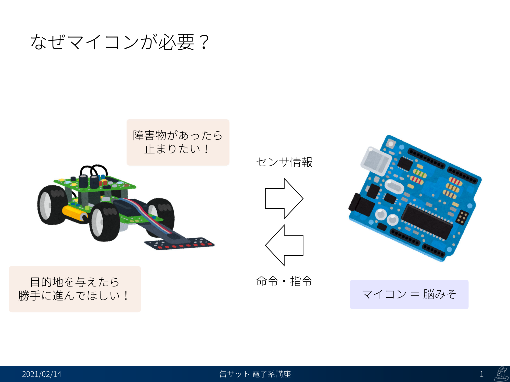
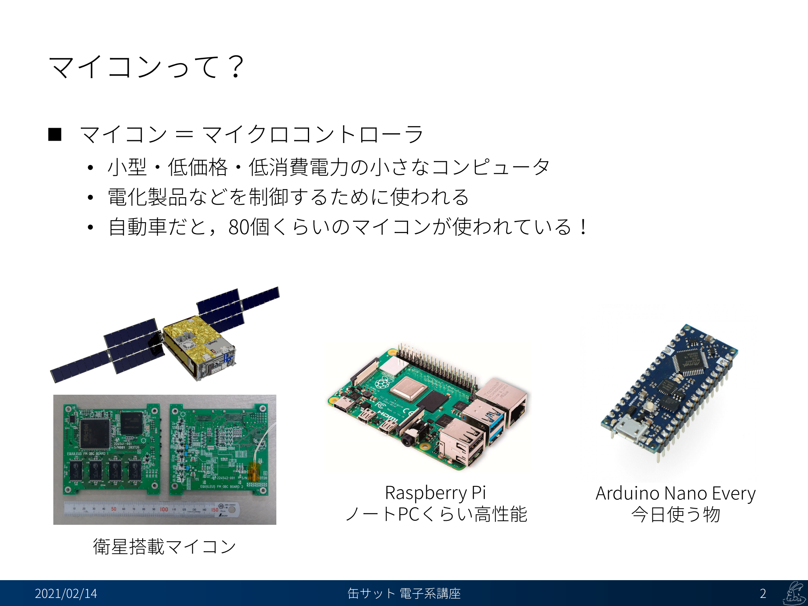
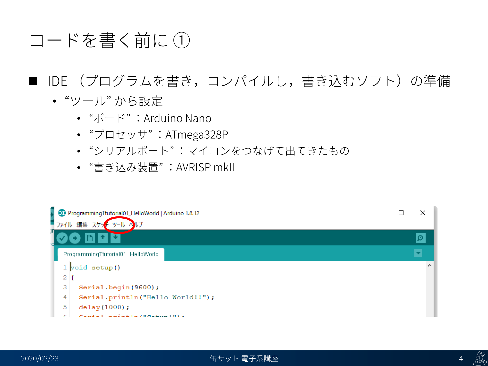
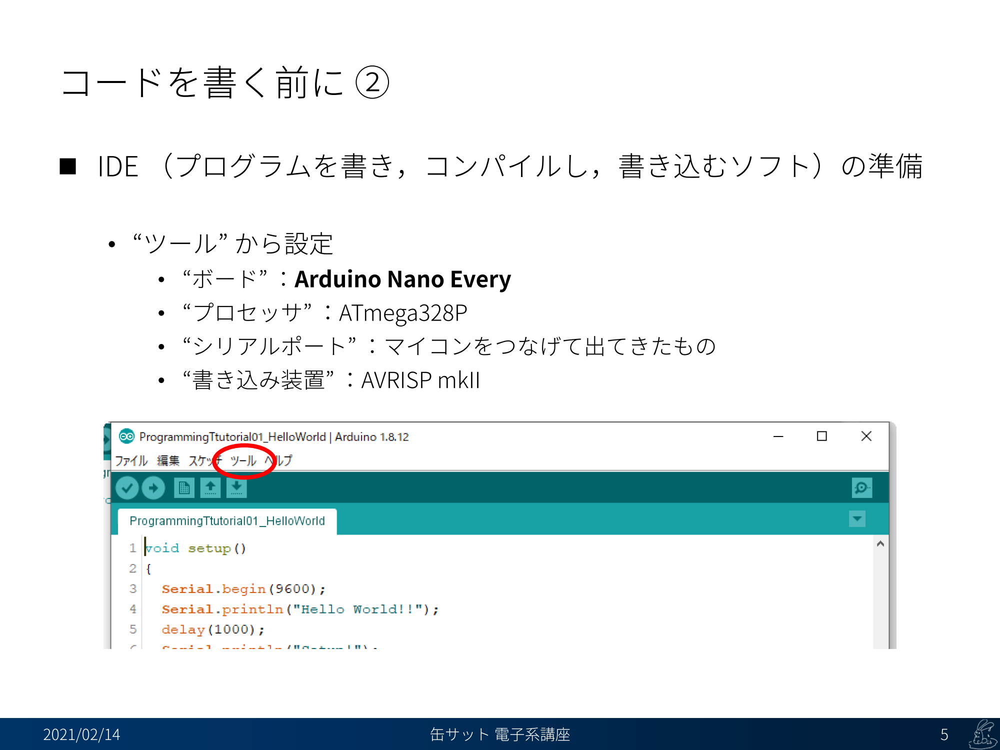
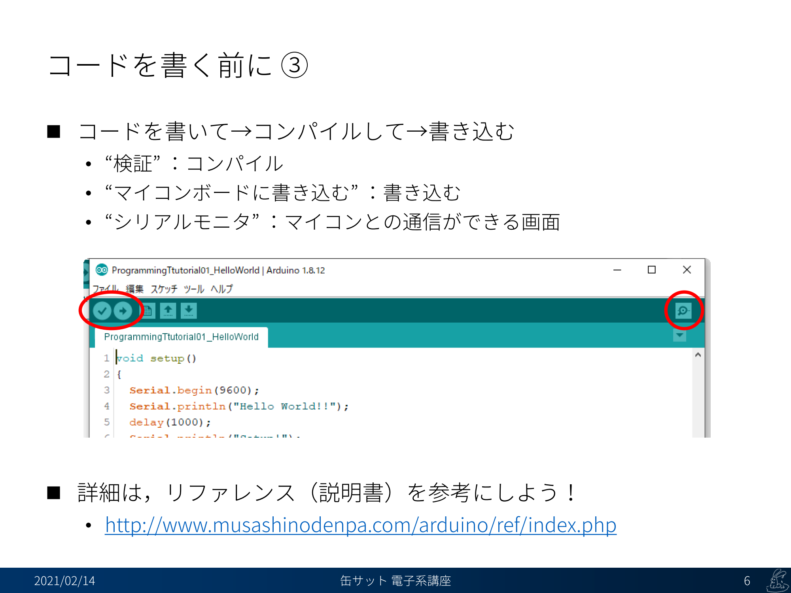

# プログラミング講習 00. 事前準備
## 概要
+ Arduino IDE でプログラミングを始めるための事前準備
+ Arduino については [こちら](../)
+ IDE（開発環境）のダウンロードはこちら
	- https://www.arduino.cc/en/main/software

## 説明スライド

## リファレンス
詳細な説明はリファレンス（説明書）を参考にしよう！  
[http://www.musashinodenpa.com/arduino/ref/index.php](http://www.musashinodenpa.com/arduino/ref/index.php)

## ソースコードへのリンク
[GitHub](https://github.com/meltingrabbit/CanSatForHighSchoolStudents/tree/master/Arduino/ProgrammingTutorial00_Preparation)
