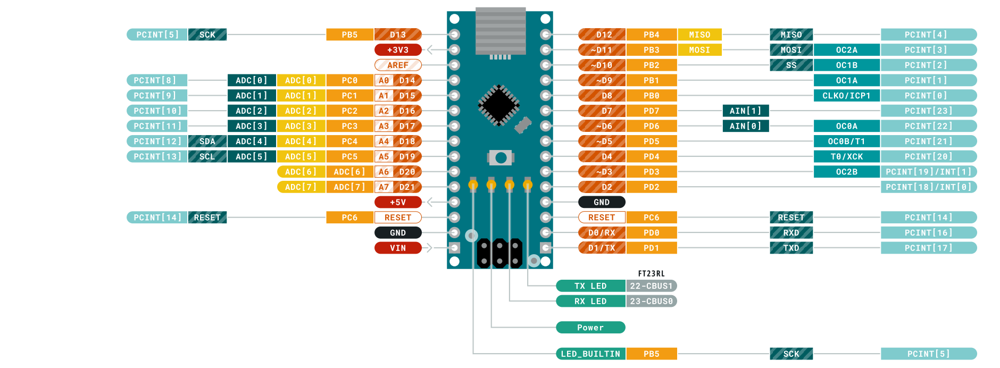
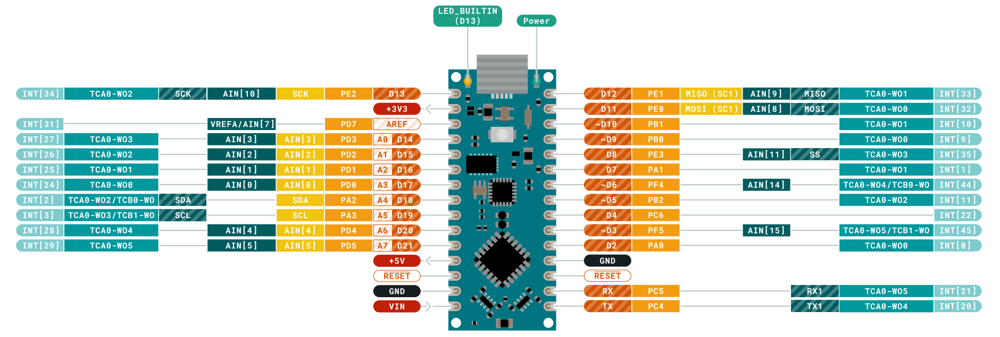

# Arduinoについて
## 概要
[Arduino](https://www.arduino.cc/)とは，電子工作初心者にも使いやすいマイコンであり，C言語風のプログラムによってソフトウェアを書く．  
特徴は以下．

+ 電子工作のデファクトであり，対応するセンサも多い．
+ コミュニティが広く，サンプルコードなどがたくさん出回っている．
+ 5V系であるため，近年主流となっている3.3V系のセンサを用いる場合はレベル変換が必要．

様々な種類があるが，CanSatには小型なNanoシリーズが適している．

## Arduino Nano
[Arduino Nano](https://store.arduino.cc/usa/arduino-nano)．  
標準的なUNOより小型なボード．

- ATmega328P搭載
	- Flashメモリ: 32 KB 内2KBはブートローダーで使用
	- SRAM: 2 KB
	- EEPROM: 1 KB
	- Clock Speed: 16 MHz
- 動作電圧: 5 V
- 入力電源電圧(推奨): 7～12 V
- デジタル入出力ピン: 14本
- PWMチャンネル: 6本
- アナログ入力チャンネル: 8本
- 直流電流(1ピン当り最大): 40 mA
- 直流電流(3.3Vピン、1ピン当り最大): 50 mA

## Arduino Nano Every
[Arduino Nano Every](https://store.arduino.cc/usa/nano-every-with-headers)．  
Arduino Nanoと同じフットプリントで高性能になった，Arduino Nanoの後継機である．

CanSatとしては，Nanoと比べてSRAMが3倍になっているのが嬉しい．  
これにより，たくさんのセンサを同時に駆動できる様になった．

- ATMega4809搭載
	- CPU Flash Memory 48 KB
	- SRAM 6KB
	- EEPROM 256byte
- 動作電圧：5 V
- 外部入力電源電圧（推奨）: 7 ～ 12 V
- I/Oピン最大電流：20 mA
- 3.3 Vピン最大電流：50 mA
- 動作周波数：20 MHz
- PWM ピン数；5 （D3, D5, D6, D9, D10）
- UART x 1
- SPI x 1
- I2C x 1
- アナログ入力ピン数 x 8 （ADC 10 bit）
- 寸法；45 mm x 18 mm

## GitHubへのリンク
[GitHub](https://github.com/meltingrabbit/CanSatForHighSchoolStudents/tree/master/Arduino)

