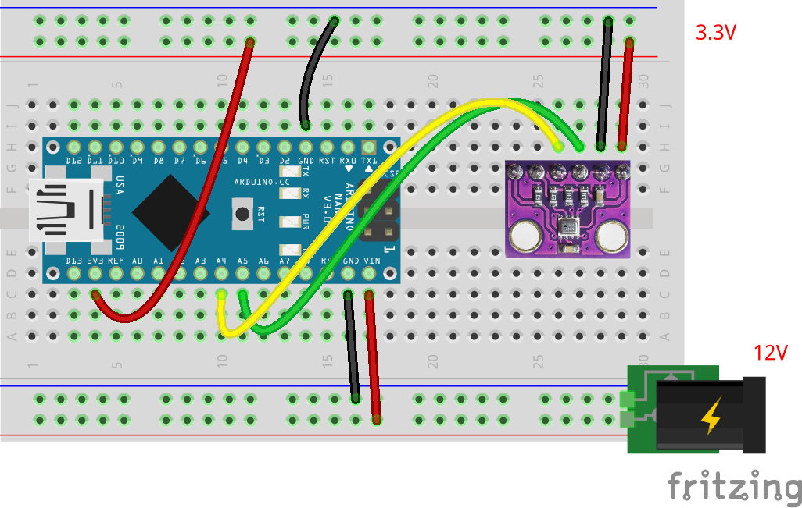

# 気圧計の単体テストコード
## 概要
気圧計の単体テストコード  
温度も取得可能  
気圧から高度が計算できる

メモリ節約のため，ライブラリは未使用  
（[Adafruitのライブラリ使用版](../Test_Barometer_with_lib/README.md)）

## 機器詳細
気圧センサ GY-BMP280-3.3  
https://www.led-paradise.com/product/2334

## 回路図

+ 通信はI2C
+ 電圧は3.3V
	- I2Cの信号線は，レベル変換を挟むとなお良い
