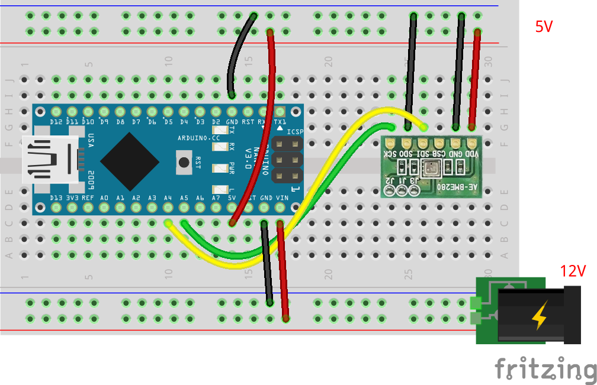
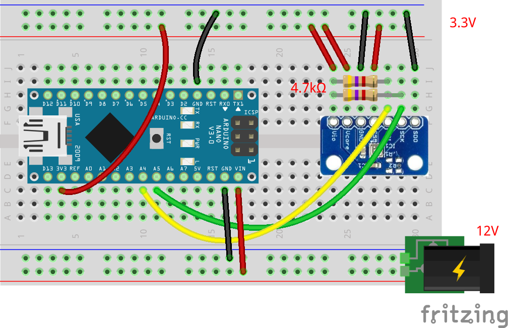

# 気圧計・温湿度計の単体テストコード
## 概要
+ 気圧計の単体テストコード
+ 温度と湿度も取得可能
+ 気圧から高度が計算できる

## 機器詳細
気圧・温湿度センサ BME280
+ 秋月電子: https://akizukidenshi.com/catalog/g/gK-09421/
+ スイッチサイエンス: https://www.switch-science.com/catalog/2236/

## 回路図（秋月電子）

| 素子 Pin | Arduino Pin | 備考 |
| ---- | ---- | ---- |
| VDD | 3V3 | 3.3V 電源 |
| GND | GND |  |
| SDI | A4 (SDA) | I2C のシリアルデータ |
| SCK | A5 (SCL) | I2C のシリアルクロック |
| SDO | GND | I2C のアドレス選択ピン．ここでは GND |
| CSB | - | 通信設定． `VDD` にするが，ここでは， J3 でジャンパさせているので未接続． |

+ 通信は I2C
+ 電圧は 3.3V
	- I2C の信号線は，レベル変換を挟むとなお良い
+ J1, J2, J3 をはんだでショートさせ， I2C として使う

## 回路図（スイッチサイエンス）

| 素子 Pin | Arduino Pin | 備考 |
| ---- | ---- | ---- |
| Vcore | 3V3 | 3.3V 電源 |
| Vio | 3V3 | I2C のプルアップ電圧 |
| GND | GND |  |
| SDI | A4 (SDA) | I2C のシリアルデータ． `Vio` でプルアップする |
| SCK | A5 (SCL) | I2C のシリアルクロック． `Vio` でプルアップする |
| SDO | GND | I2C のアドレス選択ピン．ここでは GND |
| CSB | 3V3 | 通信設定． `Vcore` にする |

+ 通信は I2C
+ 電圧は 3.3V
	- I2C の信号線は，レベル変換を挟むとなお良い
+ I2C のプルアップ抵抗値はこの図の値から多少ずれても問題ない
	- I2C のバスラインに他のセンサが接続されており，そちらでプルアップされている場合は，プルアップ抵抗は不要

## 注意
- このサンプルでは，秋月電子もスイッチサイエンスでも， I2C のアドレスが同一である．複数のセンサを用いたいなど，アドレスを変えたい場合は， `SDO` ピンを `VDD` o `Vcore` に変更するとよい．

## ソースコードへのリンク
[GitHub](https://github.com/meltingrabbit/CanSatForHighSchoolStudents/tree/master/Arduino/Test_Barometer_Thermohygrometer)
