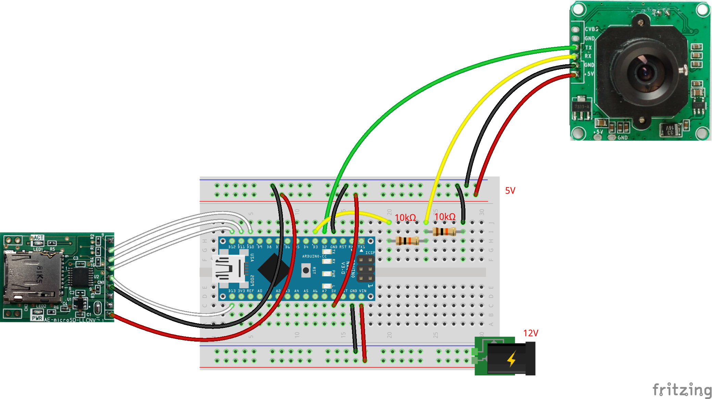

# カメラの単体テストコード
## 概要
カメラの単体テストコード

SDカードについては
[こちら](../Test_SD/README.md)
を参照

## 機器詳細
TTLシリアルJPEGカメラ  
https://www.switch-science.com/catalog/1241/

## 回路図

+ 通信はシリアル通信 (TX, RX)
+ 電源電圧は5V
+ 通信電圧は3.3V
	- 受信側のみ，10kΩで分圧
+ カメラ側のピンのピッチが通常のブレッドボードは異なるので，ブレッドボードに直差ししたい場合はピッチ変換が必要
	- 実際には，撮影場所の自由度を増すために，ジャンプワイヤーの片側をはんだ付けして用いるのが便利で楽

