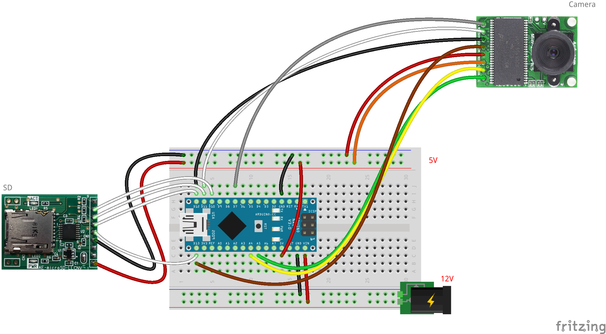
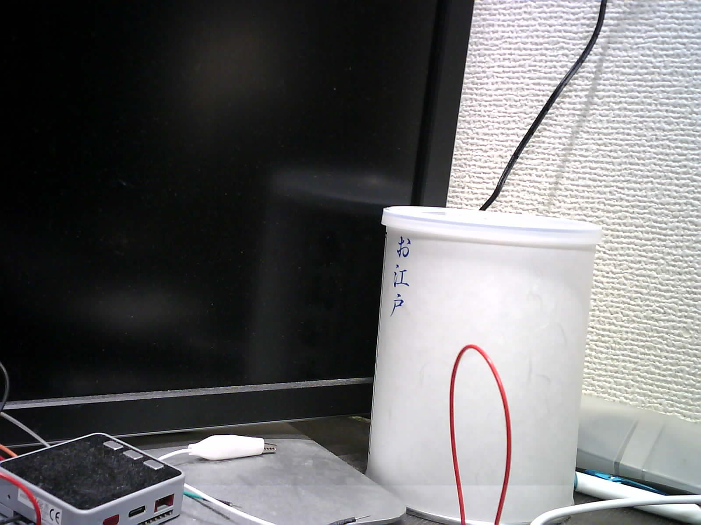

# カメラの単体テストコード
## 概要
カメラの単体テストコード

SDカードについては
[こちら](../Test_SD)
を参照

## 機器詳細
Arducam Mini 2MP Plus  
https://www.arducam.com/product/arducam-2mp-spi-camera-b0067-arduino/  
https://www.switch-science.com/catalog/3780/

## 回路図

| 素子 Pin | Arduino Pin | 備考 |
| ---- | ---- | ---- |
| CS | D7 (SS) | チップセレクト |
| MOSI | D11 (MOSI) | SPI の送信データ (Master Out Slave In) |
| MISO | D12 (MISO) | SPI の受信データ (Master In Slave Out) |
| SCLK | D13 (SCL) | SPI のシリアルクロック |
| GND | GND | GND |
| +5V | 5V | 5V 電源 |
| SDA | A4 (SDA) | I2C のシリアルデータ |
| SCL | A5 (SCL) | I2C のシリアルクロック |

+ 通信はSPI通信とI2C通信の両方
+ 電源電圧は5V
+ 撮影場所の自由度を増すために，ジャンプワイヤーの片側をはんだ付けして用いるのが便利

## 撮影画像

## ソースコードへのリンク
[GitHub](https://github.com/meltingrabbit/CanSatForHighSchoolStudents/tree/master/Arduino/Test_Camera2)

