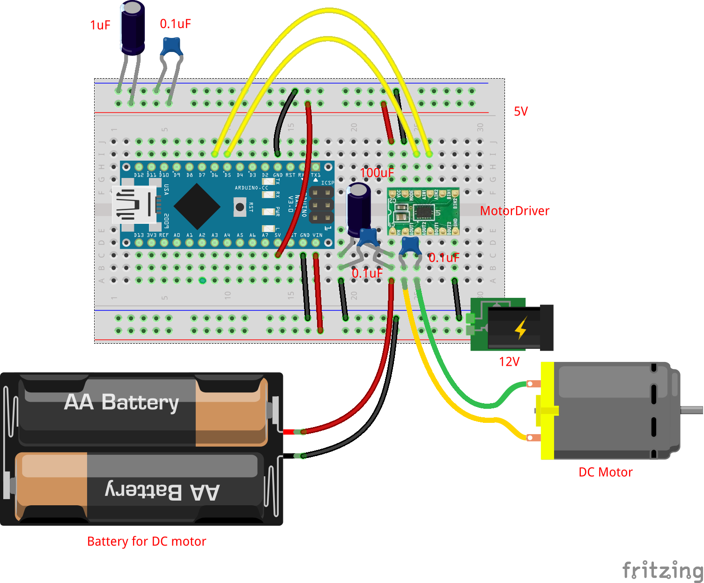

# DCモータの単体テストコード
## 概要
DCモータの単体テストコード  

## 機器詳細
ＤＣモーター　ＦＡ－１３０ＲＡ－２２７０Ｌ  
https://akizukidenshi.com/catalog/g/gP-09169/

ＤＲＶ８８３５使用ステッピング＆ＤＣモータドライバモジュール  
https://akizukidenshi.com/catalog/g/gK-09848/

## 回路図

+ DCモータの外部電源電圧は3V
+ DCモータには大電流が流れるため，マイコンとは別の電源を用意する．
	- 大電流のノイズがマイコンに悪影響を与えるのを防ぐために，コンデンサを入れている．

## ソースコードへのリンク
[GitHub](https://github.com/meltingrabbit/CanSatForHighSchoolStudents/tree/master/Arduino/Test_DCMotor)
