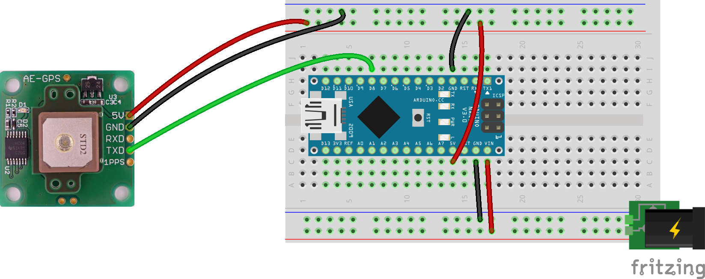
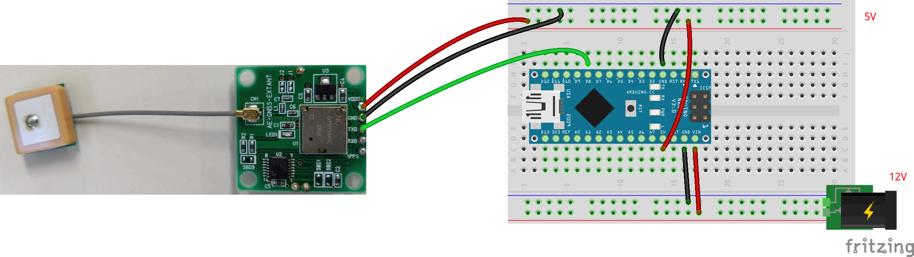

# GPSの単体テストコード
## 概要
GPSの単体テストコード

## 機器詳細
AE-GYSFDMAXB  
http://akizukidenshi.com/catalog/g/gK-09991/

## 回路図 (GPS受信機①)

| 素子 Pin | Arduino Pin | 備考 |
| ---- | ---- | ---- |
| 5V | 5V | 5V 電源 |
| GND | GND | GND |
| RXD | - | GPSセンサの受信端子．ArduinoからGPSに送る情報はないので，接続する必要はない． |
| TXD | D8 | GPSセンサの送信端子．Arduinoのシリアル受信端子と接続する． |
| 1PPS | - | 正確に1秒ごとにパルスがでる．今回は使わない． |

+ 通信はシリアル通信 (TX, RX)
+ 電圧は5V

## 回路図 (GPS受信機②)

| 素子 Pin | Arduino Pin | 備考 |
| ---- | ---- | ---- |
| 5V | 5V | 5V 電源 |
| GND | GND | GND |
| TXD | D8 | GPSセンサの送信端子．Arduinoのシリアル受信端子と接続する． |
| RXD | - | GPSセンサの受信端子．ArduinoからGPSに送る情報はないので，接続する必要はない． |
| 1PPS | - | 正確に1秒ごとにパルスがでる．今回は使わない． |

+ 通信はシリアル通信 (TX, RX)
+ 電圧は5V
+ GPS受信用のアンテナは本体とは別になっているので、GPS受信アンテナを忘れずに接続すること。

## ソースコードへのリンク
[GitHub](https://github.com/meltingrabbit/CanSatForHighSchoolStudents/tree/master/Arduino/Test_GPS)
