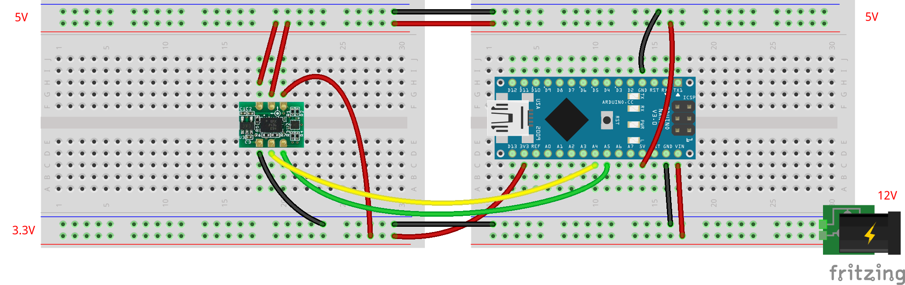

# IMU (9軸センサ) の単体テストコード (BMX055)
## 概要
IMU (9軸センサ) の単体テストコード  
9軸センサとは，以下のセンサがそれぞれ3軸あることによる

+ 加速度
+ 角加速度
+ 地磁気

## 機器詳細
BMX055 使用 9軸センサーモジュール  
http://akizukidenshi.com/catalog/g/gK-13010/

## 回路図

+ 通信は I2C
+ 電圧は 5V
	- 電源電圧，通信電圧は，素子のジャンパで 5V と 3.3V で選択可能
	- ここでは， JP6 のみをショートさせ，ともに 5V として使用している
	- 詳細はデータシートを参照のこと

## 注意
+ これは秋月電子のもの (BMX055) である．スイッチサイエンスのもの (Pololu MinIMU-9 v5) の場合は [こちら](../Test_IMU_Pololu) を参照すること．

## ソースコードへのリンク
[GitHub](https://github.com/meltingrabbit/CanSatForHighSchoolStudents/tree/master/Arduino/Test_IMU)
