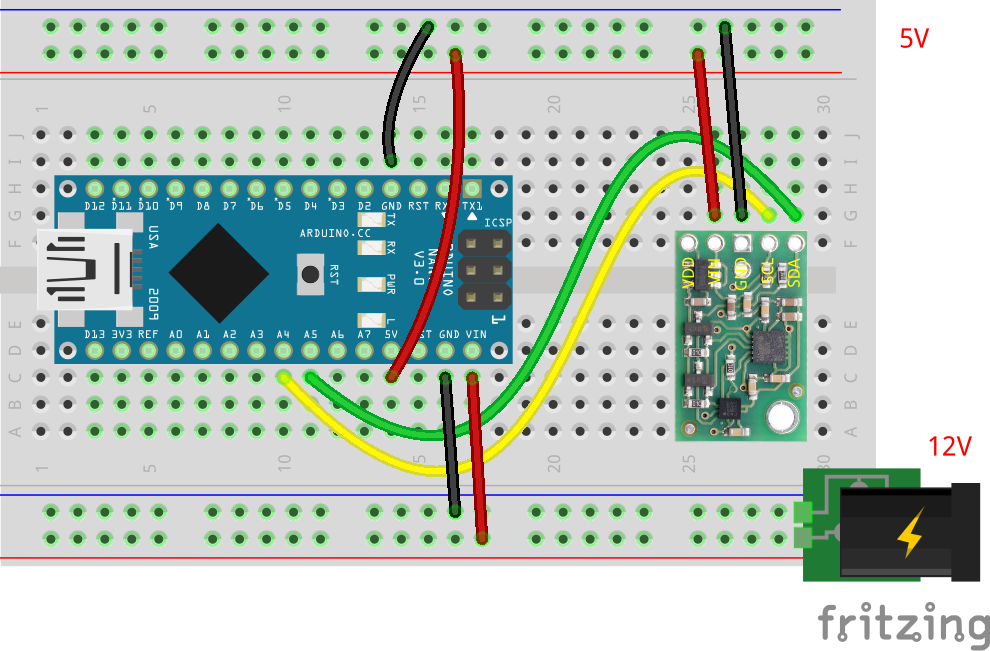

# IMU (9軸センサ) の単体テストコード (Pololu MinIMU-9 v5)
## 概要
IMU (9軸センサ) の単体テストコード  
9軸センサとは，以下のセンサがそれぞれ3軸あることによる

+ 加速度
+ 角加速度
+ 地磁気

## 機器詳細
Pololu MinIMU-9 v5  
https://www.switch-science.com/catalog/2658/

## 回路図

| 素子 Pin | Arduino Pin | 備考 |
| ---- | ---- | ---- |
| VDD | - | VIN に 5V が印加されている時は 3.3V 出力となるので，ここでは何も接続しない． |
| VIN | 5V | 5V 電源 |
| GND | GND |  |
| SDA | A4 (SDA) | I2C のシリアルデータ |
| SCL | A5 (SCL) | I2C のシリアルクロック |

+ 通信は I2C
+ 電圧は 5V
	- 電源電圧，通信電圧は， 5V と 3.3V で選択可能
	- ここでは， 5V を利用している． `VDD` には何もつないではならない．
	- 詳細はデータシートを参照のこと

## 注意
+ これはスイッチサイエンスのもの (Pololu MinIMU-9 v5) である．秋月電子のもの (BMX055) の場合は [こちら](../Test_IMU) を参照すること．

## ソースコードへのリンク
[GitHub](https://github.com/meltingrabbit/CanSatForHighSchoolStudents/tree/master/Arduino/Test_IMU_Pololu)
