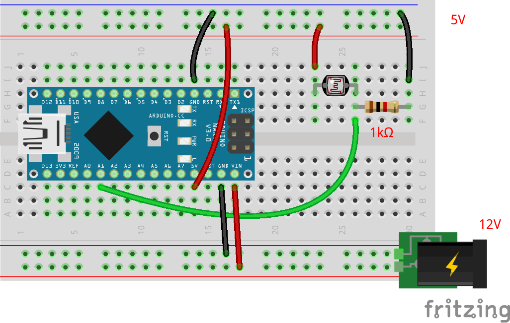

# 光センサの単体テストコード
## 概要
光センサの単体テストコード

## 機器詳細
ＣｄＳセル　５ｍｍタイプ  
http://akizukidenshi.com/catalog/g/gI-00110/

## 回路図

+ 照射した光の強度に応じて抵抗が減少する
	- プルダウンしておき，アナログ入力でセンサを読みとる

## ソースコードへのリンク
[GitHub](https://github.com/meltingrabbit/CanSatForHighSchoolStudents/tree/master/Arduino/Test_Light)

