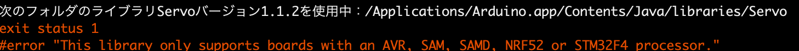
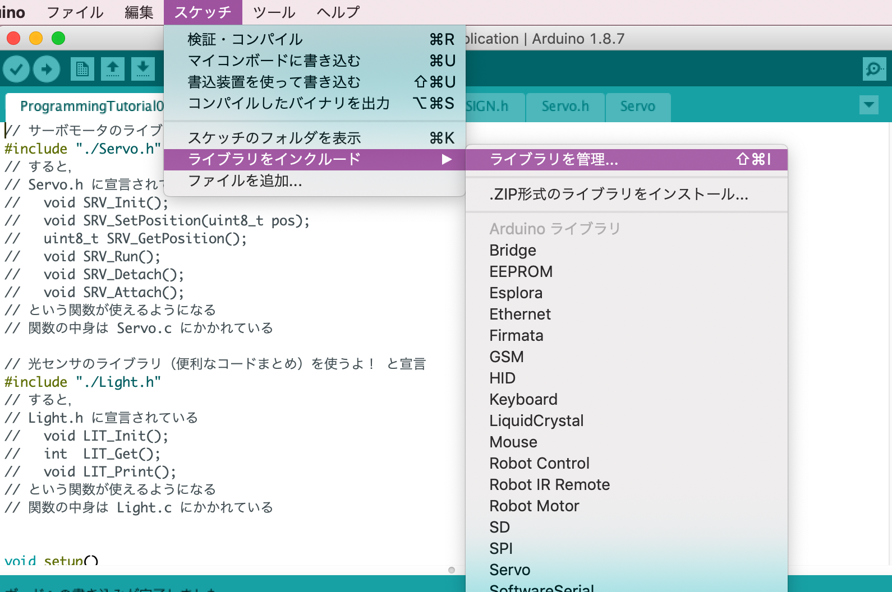
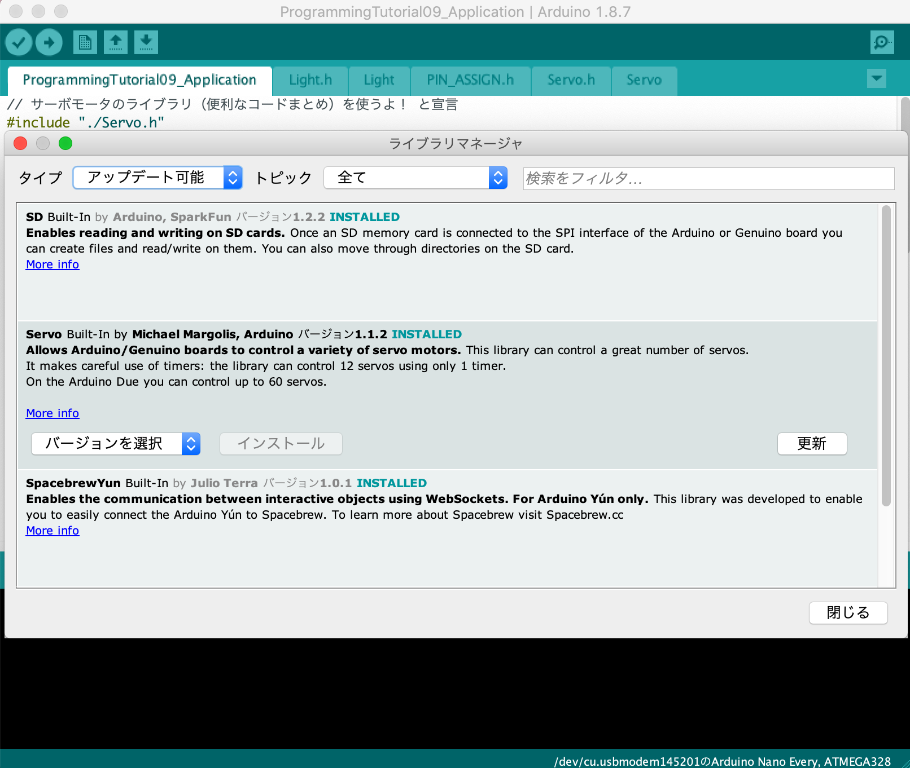

# サーボモータの単体テストコード
## 概要
サーボモータの単体テストコード

## 機器詳細
マイクロサーボ　ＳＧ９２Ｒ  
http://akizukidenshi.com/catalog/g/gM-08914/

## ライブラリ
+ Arduinoの標準ライブラリであるServoライブラリを使用
+ Servoライブラリのバージョンが古いとArduino nano everyに対応しておらず，エラーが出る

+ エラーが出た場合は，スケッチ＞ライブラリをインクルード＞ライブラリを管理 を選択
+ タイプから「アップデート可能」を選択し，Servoがあれば「更新」を選択

## 回路図
+ 信号電圧は5V

## ソースコードへのリンク
[GitHub](https://github.com/meltingrabbit/CanSatForHighSchoolStudents/tree/master/Arduino/Test_Servo)

