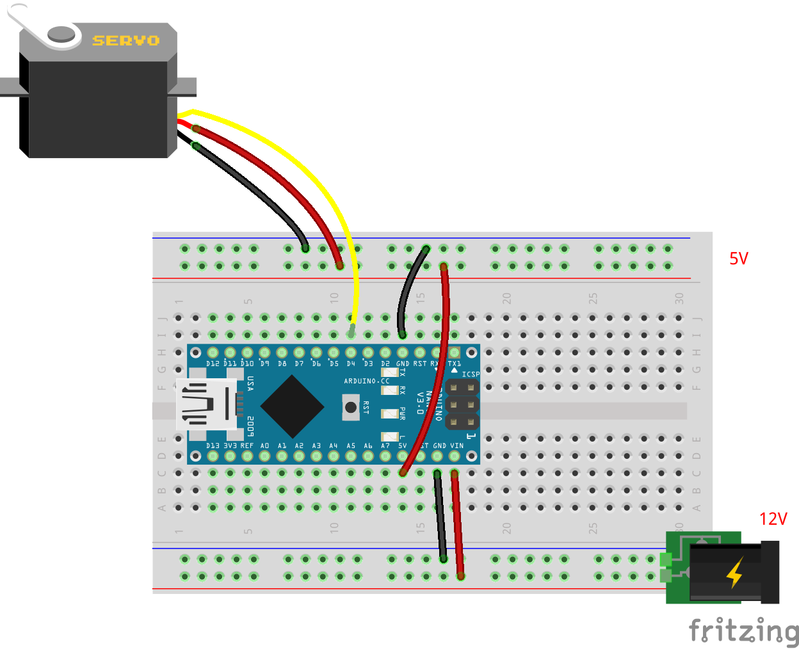

# サーボモータの単体テストコード
## 概要
サーボモータの単体テストコード

## 機器詳細
マイクロサーボ　ＳＧ９２Ｒ  
http://akizukidenshi.com/catalog/g/gM-08914/

## 回路図

+ 信号電圧は5V
+ Arduinoの標準ライブラリであるServoライブラリを使用

## ソースコードへのリンク
[GitHub](https://github.com/meltingrabbit/CanSatForHighSchoolStudents/tree/master/Arduino/Test_Servo)

