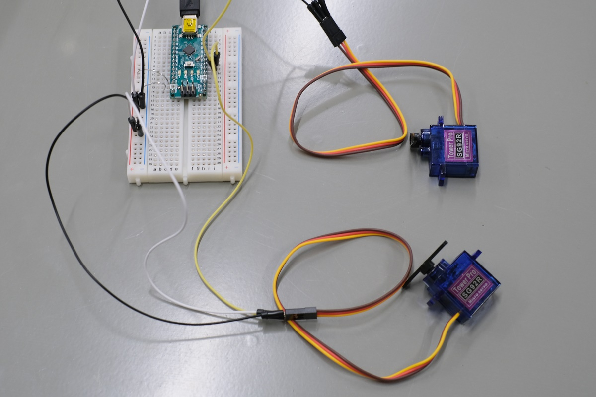

# サーボモータの単体テストコード（２並列版）
## 概要
サーボモータの単体テストコード（２並列版）  
[サーボモータの単体テスト](../Test_Servo) を４並列にしたもの．  
そろそろ許容電流量が気になるところ...（本当は電源ラインを別から引くべき）  
回路図などの詳細は[サーボモータの単体テスト](../Test_Servo)を参照すること．

## 機器詳細
マイクロサーボ　ＳＧ９２Ｒ  
http://akizukidenshi.com/catalog/g/gM-08914/

## 回路図

## ソースコードへのリンク
[GitHub](https://github.com/meltingrabbit/CanSatForHighSchoolStudents/tree/master/Arduino/Test_Servo2)

