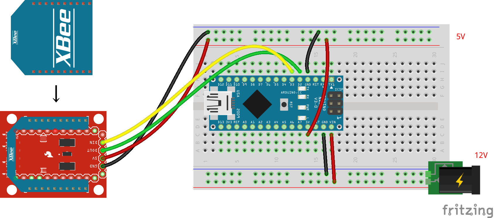

# XBee（無線通信機）の単体テストコード
## 概要
XBee（無線通信機）の単体テストコード

## 機器詳細
XBee S2C / ワイヤアンテナ型  
https://www.switch-science.com/catalog/4089/  
XBeeエクスプローラ5Vマイコン用（ピッチ変換 兼 レベル変換）  
https://www.switch-science.com/catalog/1166/  
XBee USB アダプター rev.2（PC側XBee用）  
https://www.switch-science.com/catalog/3495/

## 回路図

+ 通信はシリアル通信 (TX, RX)
+ 電圧は5V

## Xbeeの事前設定
下のページの「設定」を進めて，２つのXbeeのペアリングをしておく必要がある．  
どちらのXbeeがPC用 / 缶サット用なのかがわからなくならないように，印をつけておくとよい．  
https://qiita.com/s_fujii/items/9804eaf3599139164aa3

## ソースコードへのリンク
[GitHub](https://github.com/meltingrabbit/CanSatForHighSchoolStudents/tree/master/Arduino/Test_XBee)
