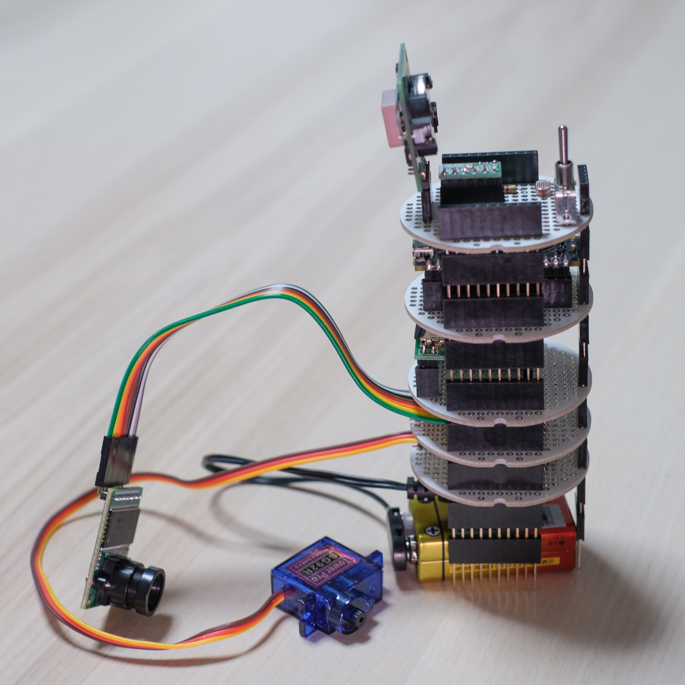
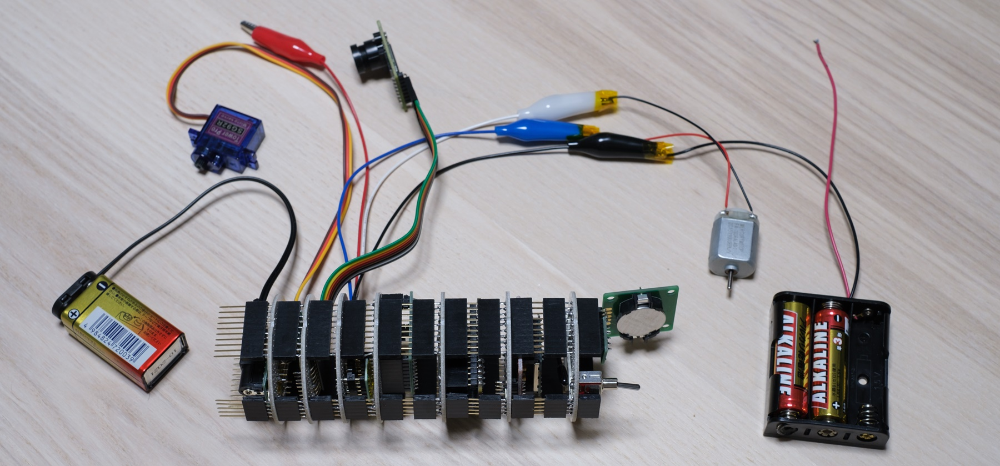
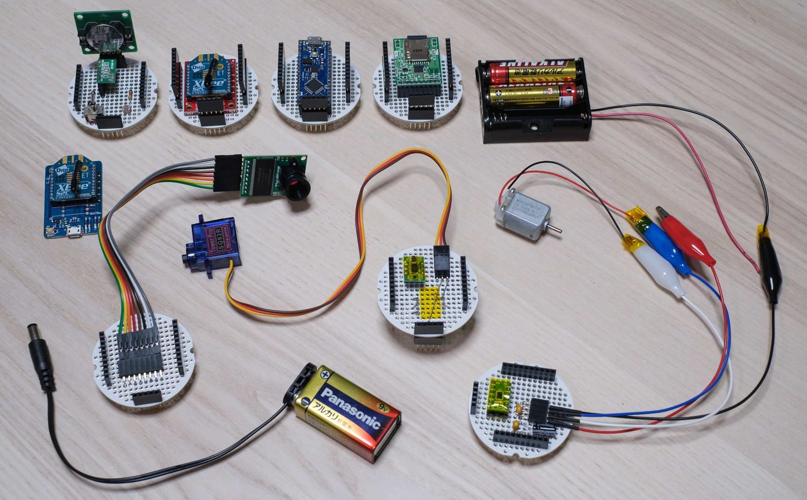
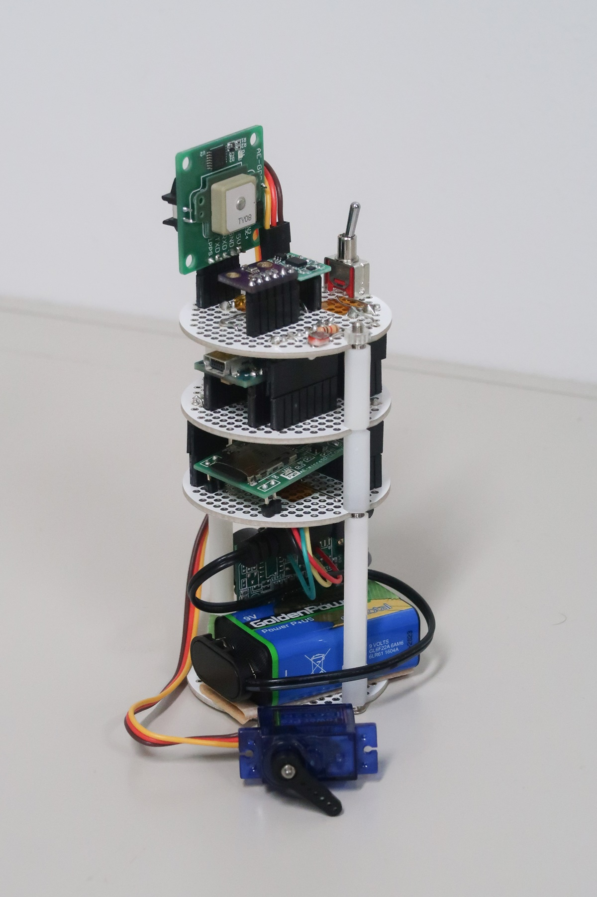

<!-- README.md -->
# 高校生のためのCanSat開発キット
CanSat for High School Students  
高校生のためのCanSat開発キット

## リンク
[GitHub](https://github.com/meltingrabbit/CanSatForHighSchoolStudents)  
[Web Page](https://meltingrabbit.github.io/CanSatForHighSchoolStudents/)

## 概要
+ 高校生向け缶サット開発キット
+ [Arduino Nano Every](https://store.arduino.cc/usa/nano-every-with-headers)を想定
	- Arduino Nanoでも可能だが，よりSRAMの多いEveryを用いたほうがよい．

### Ver.2.1 （2022年版）
Ver.2 から，半導体不足等で入手困難なセンサ類を変更したバージョン．

### Ver.2 （2021年版）
+ Ver.1で難易度の高かった配線を簡易化するため，すべての階層に同じマイコンのピンをストレートで伸ばしたもの．
+ これにより，層の順番の変更や，取捨選択が可能となった．

  

### Ver.1 （2020年版）
 

### 利用について
本資料の活用については制限しておりませんが，その際には以下までご一報いただければ幸いです．
+ melting.rabbit.mr[at]gmail.com

## 搭載機器
機器の詳細な型番などは[パーツリスト](./Structure/PartsList)を参照のこと．

### センサ
+ GPS
+ 9軸センサ
+ 高度計（気圧計）
+ 温湿度計
+ 光センサ
+ カメラ

### アクチュエータ
+ サーボモータ
+ DCモータ

### 通信機
+ XBee

### ストレージ
+ SDカード

## 資料一覧
+ `./Arduino` ：サンプルコードとその設定など
	- [Arduinoについて](./Arduino/)
	- 機器のテストコード（動作試験）
		* [GPSの単体テスト](./Arduino/Test_GPS)
		* [9軸センサ (IMU) の単体テスト (BMX055)](./Arduino/Test_IMU)
		* [9軸センサ (IMU) の単体テスト (Pololu MinIMU-9 v5)](./Arduino/Test_IMU_Pololu)
		* [高度計（気圧計）・温湿度計の単体テスト](./Arduino/Test_Barometer_Thermohygrometer)
		* [光センサの単体テスト](./Arduino/Test_Light)
		* [カメラの単体テスト](./Arduino/Test_Camera2)
		* [サーボモータの単体テスト](./Arduino/Test_Servo)
		* [DCモータの単体テスト](./Arduino/Test_DCMotor)
		* [SDカードの単体テスト](./Arduino/Test_SD)
		* [XBee（無線通信機）の単体テスト](./Arduino/Test_XBee)
		* 過去
			+ [カメラ（2020年使用版）の単体テスト](./Arduino/Test_Camera)
			+ [高度計（気圧計）（2020年使用版）の単体テスト](./Arduino/Test_Barometer)
	- 機器のテストコード（複数使用）
		* [全機器の統合状態のテスト](./Arduino/Test)
		* [光センサを４並列にした光方向センサ](./Arduino/Test_Light4)
		* [サーボモータの２並列版](./Arduino/Test_Servo2)
		* [DCモータの２並列版](./Arduino/Test_DCMotor_x2)
	- プログラミング講習
		* [00. 事前準備](./Arduino/ProgrammingTutorial00_Preparation)
		* [01. HelloWorld](./Arduino/ProgrammingTutorial01_HelloWorld)
		* [02. Variable](./Arduino/ProgrammingTutorial02_Variable)
		* [03. Operator](./Arduino/ProgrammingTutorial03_Operator)
		* [04. If Else](./Arduino/ProgrammingTutorial04_IfElse)
		* [05. Loop](./Arduino/ProgrammingTutorial05_Loop)
		* [06. Function](./Arduino/ProgrammingTutorial06_Function)
		* [07. Device1 （高度計）](./Arduino/ProgrammingTutorial07_Device1)
		* [08. Device2 （方位磁石）](./Arduino/ProgrammingTutorial08_Device2)
		* [09. Device3 （サーボモータの利用）](./Arduino/ProgrammingTutorial09_Device3)
		* [10. Application （明るさ計）](./Arduino/ProgrammingTutorial10_Application)
	- 実装例
		* [明るさ計](./Arduino/App_LightMeter)
+ `./Schematic` ：[回路図](./Schematic)
+ `./Structure` ：[構造など](./Structure)
	- [パーツリスト](./Structure/PartsList)
	- [ユニ基板詳細](./Structure/board)
	- [電源スイッチ](./Structure/switch)
	- [テスタ](./Structure/tester)
+ `./Archives` ：アーカイブ
	- [2020年02月22～23日 缶サットHigh School 「缶サット電子系講座」](./Archives/2020-02-22_Fukui)
	- [2021年06月19～20日 缶サットHigh School 「缶サット構造系講座」](./Archives/2021-06-19_Fukui)
	- [2022年03月19～20日 缶サットHigh School 「缶サット電子系講座」](./Archives/2022-03-19_Fukui)

## ブログ
+ [【CanSat】缶サット甲子園を目指す高校生向け電子系講座 2020年度版 @福井 [2020/02/23]](https://meltingrabbit.com/blog/article/2020022301/)
+ [【CanSat】缶サット甲子園を目指す高校生向け構造系講座 2020年度版 @福井 [2020/10/25]](https://meltingrabbit.com/blog/article/2020102501/)
+ [【CanSat】缶サット甲子園を目指す高校生向け電子系講座 2021年度版 @福井 [2021/02/14]](https://meltingrabbit.com/blog/article/2021021401/)
+ [【CanSat】缶サット甲子園を目指す高校生向け構造系講座 2021年度版 @福井 [2021/06/20]](https://meltingrabbit.com/blog/article/2021062001/)
