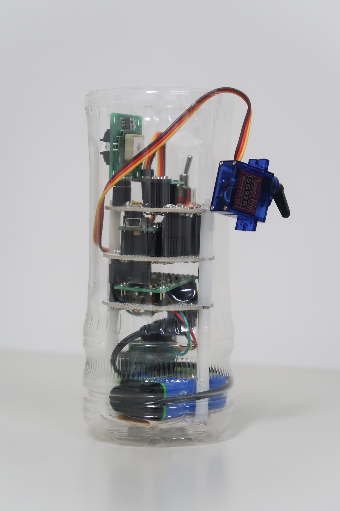
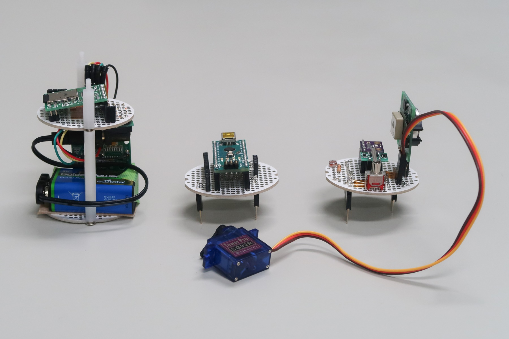
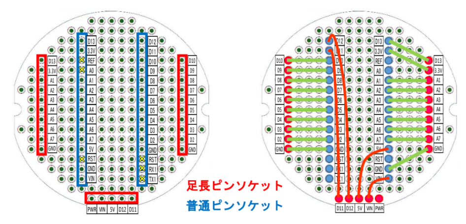

# 構造
## 概要
+ ユニバーサル基板を用いて配線と構造を組む
+ [詳細画像はこちら](./board)
<!--

-->

### Ver.2 （2021年版）
+ Ver.1で難易度の高かった配線を簡易化するため，すべての階層に同じマイコンのピンをストレートで伸ばしたもの．
+ これにより，層の順番の変更や，取捨選択が可能となった．

 

マイコン層のピンアサインは以下の通り．

### Ver.1 （2020年版）
 

## パーツ
[電源スイッチ](./switch)
